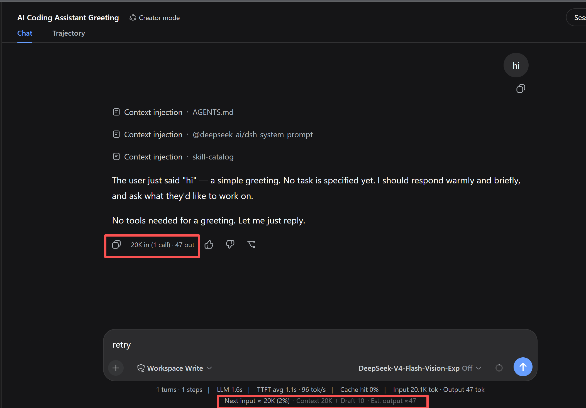
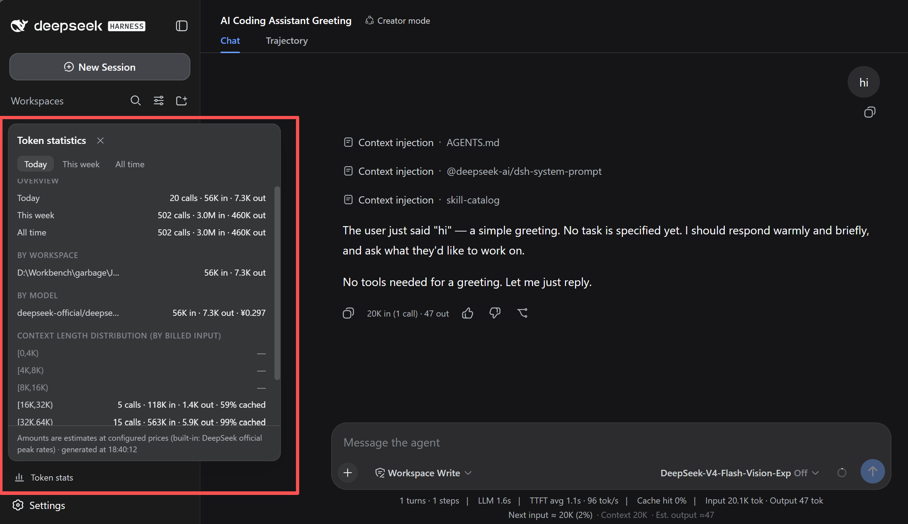

# dsh-plugins

[简体中文](./README.md) | English

Personal extension pack for [DeepSeek Harness (DSH)](https://github.com/deepseek-ai/deepseek-harness).
One repo = one profile bundle: all plugins live in a single pack — adding a plugin is just code + a restart, no reinstall.

## Plugins

| Plugin      | Function                                                                                          |
| ----------- | ------------------------------------------------------------------------------------------------- |
| **tokprev** | "Next-turn input preview" below the Composer (context + queued + draft, live as you type) + a real usage badge on each turn's closing message (provider-reported: input / cache / output / call count) |
| **tokstats** | Sidebar-footer button + popover: cross-session token consumption stats (period overview / by workspace / by model with cost / context-length buckets, today · this week · total switch) |

> As of v0.2.4 this pack is **mixed**: tokprev is pure browser UI; tokstats ships a host half (scans durable session logs, incremental checkpoint, publishes via the projection channel).

## Language (Chinese / English)

Both plugins render their copy through the host locale service and **follow DSH Settings → General → Language**; the pack itself has no language switch.

- Dictionaries are namespaced per plugin — `dsh-plugins.tokprev` and `dsh-plugins.tokstats` — registered by `lib/client.js`'s apply (zh is the key-set source of truth; en must match key for key, asserted bidirectionally by the tests).
- With no explicit choice the host falls back to the browser language, and to en when it is neither zh nor en.
- `locale` is a **hard dependency** (as in official UI packs): when the host has no locale service (or it is disabled by hand), the whole bundle does not load — the UI disappears with no log line, rather than showing half-translated copy.
- Number notation (1.2K / 3.4M), context bucket ranges (`[0,4K)`) and the ¥ sign are not translated (they read the same in English, and ¥ is DeepSeek's official RMB pricing — CNY would mislead); the panel footer clock is fixed 24-hour, independent of the browser locale.

## tokprev

A closed loop for per-turn token consumption: before you send, it tells you roughly how many tokens the next turn will feed in; after the turn ends, it reconciles with provider-reported actuals.



Note: the badges below are annotated on the English UI; the copy labels are translated by the host locale service.

### Pre-send preview (below the Composer)

Example:

> **Next-turn input ≈ 36.2K (28%)** · context 33.8K + queued 0.1K + draft 0.3K · output estimate 1.5K–3K

- **Next-turn input** = context base (`contextPressure.projectedTokens`, provider-anchored) + queued messages + draft — updates live as you type;
- **Percentage** = next-turn input / context window;
- **Output estimate** = the [P25, P75] range of the last 5 turns' actual `outputTokens`; `-` with no history, `≈value` with exactly one turn;
- Fallback: with no provider anchor (fresh session) it falls back to a heuristic estimate (`contextBreakdown`, sum of three buckets) and prefixes the context figure with `*`; while the session is running the whole line hides (nothing to predict), and reappears when idle.

### Per-turn actual usage badge

A muted one-liner rendered on the closing assistant message of each turn (durable — survives page refresh and shows on history turns):

> `This turn: input 12.4K (3 calls · cache 11.8K) · output 2.1K`

- Data is the provider-reported truth, summed over all calls in the turn; billed input = `inputTokens + cacheReadTokens + cacheWriteTokens`;
- Hover for exact token counts and call count.

### A note on metrics (preview ≠ badge)

- The **preview** estimates the prompt size of a single request;
- The **badge** reports the **sum of billed input across all calls of the turn** — in a multi-step turn every step resends the full context, so the total is far larger than a single request; the cache-hit field (the "cache" segment in the badge) explains the gap. The two measure different things, both meaningfully.

### Host contracts

UI slots `conversation.composer.dock` and `conversation.chat.assistant-actions`; projection fields `contextPressure` / `contextBreakdown`; `AssistantMessageNode.usage`. Every read path degrades gracefully (renders null when data is missing, never throws).

## tokstats

Cross-session token consumption stats: the host's StatsLine only sees one session; this plugin scans every durable session log to answer "how much did I burn today", "which project eats the most", "how often do I run long contexts".



A "Token 统计" button at the sidebar footer (an icon seat in rail mode) opens a popover panel:

- **Overview**: today / this week (Monday-based) / total — call count and the four buckets (tokens only, no money);
- **By workspace**: top 8 (subagent usage merges up the parent chain into the root workspace; fork seed prefixes are deduplicated, never double-counted);
- **By model**: provider/model rows with an estimated cost column (a 「未配价」 marker when unpriced);
- **Context-length distribution**: billed input binned into power-of-two buckets `[0,4K)…[128K,∞)` with requests / input / output / cache-hit rate.

Same accounting as the host: billed input = `inputTokens + cacheReadTokens + cacheWriteTokens`; the final `assistant/message.usage` of a `(turn, step)` replaces its usage-chunk sample (no double counting). Money figures are **estimates**: built-in DeepSeek official peak rates (CNY/Mtok, overridable), and the panel says so.

### Pricing config (optional)

Built-in prices only cover the `deepseek-official` route. For third-party providers, append to your profile patch (`~/.dsh/profiles/web/cordis.patch.yml`, CNY/Mtok):

```yaml
- id: tokstats
  patch:
    config:
      prices:
        ark-codingplan:
          glm-5.3: { input: 2, inputCached: 0.2, output: 4 }
```

### Host-side behavior

- Asynchronous boot scan (never blocks startup): `listSnapshots` reconciles the checkpoint (`$DSH_HOME/storages/tokstats-checkpoint.json`, keyed by `(sessionId, storage revision)`) and re-inspects only sessions whose logs changed; a corrupt checkpoint falls back to a full rescan;
- Live sessions refold incrementally from the last seq after each flush; changes are checkpointed with a debounce;
- Data flows through the `sessionProjections` channel (`tokstats` unit); right after first install the panel shows "统计中…" until some session is opened or a push arrives;
- Fully degraded: missing persistence/projection services never throw — the panel explains.

## Installation (web profile)

Prerequisites: Node.js, git, pnpm (`npm i -g pnpm`). Private repos work too (pnpm uses your local git credentials).

```powershell
# Install from GitHub (other users)
npx @deepseek-ai/dsh plugin --profile web add github:PlusQi/dsh-plugins

# Pin a version: # accepts a tag / branch / commit
npx @deepseek-ai/dsh plugin --profile web add github:PlusQi/dsh-plugins#v0.2.3

# Local dev link (edit + restart to see changes; replace with your local repo path)
npx @deepseek-ai/dsh plugin --profile web add link:D:\path\to\dsh-plugins
```

After installing, **restart the dsh web process** and reload the page (profile composition only happens at startup).
Install location: `$DSH_HOME/profiles/web/` (default `~/.dsh`). `dsh plugin` is a pnpm forwarder:
after install it automatically attaches packages declaring `dsh.bundle` to the `dsh.profile.bundles` layer list — no manual config edits.
This pack has no build scripts, so git installs never trip pnpm's build-script gate (allowBuilds).
If published to npm, `npx @deepseek-ai/dsh plugin --profile web add dsh-plugins` works the same way.

## Update / uninstall / toggling a single plugin

```powershell
# Update: re-resolves the install spec (unpinned refs pull the default branch's latest commit)
npx @deepseek-ai/dsh plugin --profile web update dsh-plugins

# Uninstall the whole pack (auto-detached from the layer list)
npx @deepseek-ai/dsh plugin --profile web remove dsh-plugins
```

To temporarily disable a single plugin (no code changes): append to `~/.dsh/profiles/web/cordis.patch.yml`

```yaml
- id: tokprev
  disabled: true
```

Restart to apply. Note the row's real semantics: `disabled` removes that row's **host-side** fiber only — whether the browser bundle loads depends on **whether any row of the pack is still live** (DSH's boot graph keys on package name; the client has one fiber per package that registers ALL plugins unconditionally). For a plugin whose host half does real work — like tokstats — disabling its row stops the aggregator (the client button stays but shows no data); for a pure-UI plugin like tokprev, disabling one row does **not** remove its browser UI (the remaining rows keep the whole bundle alive). For a per-plugin off-switch, split the plugin into its own package (see the end of "Adding a new plugin" below).

## Publishing to GitHub (maintainers)

```powershell
git remote add origin git@github.com:PlusQi/dsh-plugins.git
git push -u origin master
git tag v0.2.0; git push --tags   # optional: tag a version users can pin
```

**Hard gate before tagging** (the lesson of v0.2.0's three failed rounds — see the [postmortem](./docs/debug/postmortem-v0.2.md)): link-install the target commit -> restart dsh web -> reload the page and visually verify **every plugin's** UI elements actually render. "Boots without errors ≠ plugin works" — slot registration is a side effect; an apply that returns early or throws can fail silently. No green visual check, no tag.

Push and it's installable — no registry needed. The `files` field keeps git installs to
`lib/` + `cordis.patch.yml` (pnpm automatically includes README / LICENSE / package.json when packing).

## Adding a new plugin (pack maintenance mode)

1. Add one entry to the `PLUGINS` registry in `lib/client.js`: `css` + `apply(ctx)` (helpers, components, and the `ctx.slots.inject(...)` registration block all live in this section);
2. Add one row to `cordis.patch.yml` (`name` is always `'dsh-plugins'`, `config.plugin` points to the registry key; prefix the id with your own so it never collides with dsh-base/dsh-web-app builtin ids):

   ```yaml
   - id: xxx
     name: 'dsh-plugins'
     config:
       plugin: xxx
   ```

3. Keep a local decision record for that plugin (not shipped with the repo, for maintainers to look back on);
4. Restart the process. **Zero install operations.**

Four hard constraints of the multi-plugin structure (from DSH itself — read before changing):

- **Client bundles are discovered by package name**: the host resolves `<name>/package.json` by the entry's `name` to read the `dsh.client` declaration, and serves the whole package via `exports["./client"]`. The row's name must be the bare package name `dsh-plugins`; a subpath like `dsh-plugins/xxx` only loads the host half (dsh-web-app's `web-startup` row is exactly this host-only subpath usage).
- **The client module graph is flat per package**: a package's client half = one module node — no splitting into multiple files (a bundle factory's `require` only knows module-table words; relative paths throw). All plugins share the single `lib/client.js` file, kept sane by section discipline — that's the boundary of "no build step".
- **Host gets one fiber per row; the client gets one fiber per package**: each patch row creates a **host** fiber, and `config.plugin` is a host-plane dispatch key (dsh-base's `tool-subagent` / `tool-subagent-fork` is the same-name multi-row reference). This pack's `lib/index.js` dispatches `apply(ctx, config)` on that key: pure-UI plugins have empty host halves (rows act as presence / disable anchors), while tokstats's aggregator rides the `tokstats` row's fiber (row disabled = stats stop). The **client-side `__DSH_BOOT__` manifest creates ONE entry per package with no config** (`dsh-client-modules` builds its boot graph keyed by package name), so `lib/client.js`'s apply registers ALL `PLUGINS` entries unconditionally and components return null when their data is missing. There is no "second row runs apply again" client-side, and dispatching by `config.plugin` in the client is impossible. The host half has an extra module-graph constraint: under pnpm link installs the plugin's real path sits outside the host's node_modules tree, so **npm-package imports don't resolve** — `lib/index.js` uses only `node:` builtins plus the `apply(ctx, config)` arguments, importing no cordis/zod runtime dependency.
- **Styles are tagged per plugin**: give each plugin its own `data-plugin-css="dsh-plugins/<id>"` tag (`ensurePluginStyles` idempotent insert, removed when the pack fiber stops); this keeps per-plugin granularity so a plugin split out into its own package later takes its styles along verbatim.

Outgrown the pack and want independent releases / a separate repo? Copy the registration block plus the patch row into a new package (see how the existing plugins in this repo are implemented and packaged).

## Maintenance notes

- **No build step**: `lib/client.js` is the shipped artifact (plain JS, no TS/JSX; React is injected by the ModuleLoader). Changes = edit + restart. The host half `lib/index.js` is likewise plain JS: it imports only `node:` builtins (fs/os/path), no npm runtime dependency.
- **Compatibility surface**: tokprev depends on UI slot contracts (`conversation.composer.dock`, `conversation.chat.assistant-actions`) and projection fields (`contextPressure`/`contextBreakdown`/`AssistantMessageNode.usage`); tokstats depends on the `sidebar.footer.action` slot (root scope — standard seats are only `useSessions`/`useWorkspaces`; the projection value is read from the session-list snapshot's `projectionValues`), host services `ctx.sessionPersistence` (`listSnapshots`/`inspect`/`readStoredRevision`) and `ctx.sessionProjections` (registers the `tokstats` unit), and the `session/flush` event. Interface copy additionally depends on the client service `ctx.locale` (dictionary registration + the `locale` namespace declared on slot registrations to obtain the `t` seat) — a hard dependency: without it the whole bundle does not load. If a plugin vanishes after a DSH upgrade, check these contracts first. Every read path degrades gracefully (renders null when data is missing, never throws).
- **Developed against**: DSH `@deepseek-ai/dsh 0.1.1-rc.2`.
- **Dev loop**: prototype live in a session with dynamic Cordis plugins (`cordis_define` -> `cordis_run`) first, then land it in this pack once satisfied.

## License

[MIT](./LICENSE)
