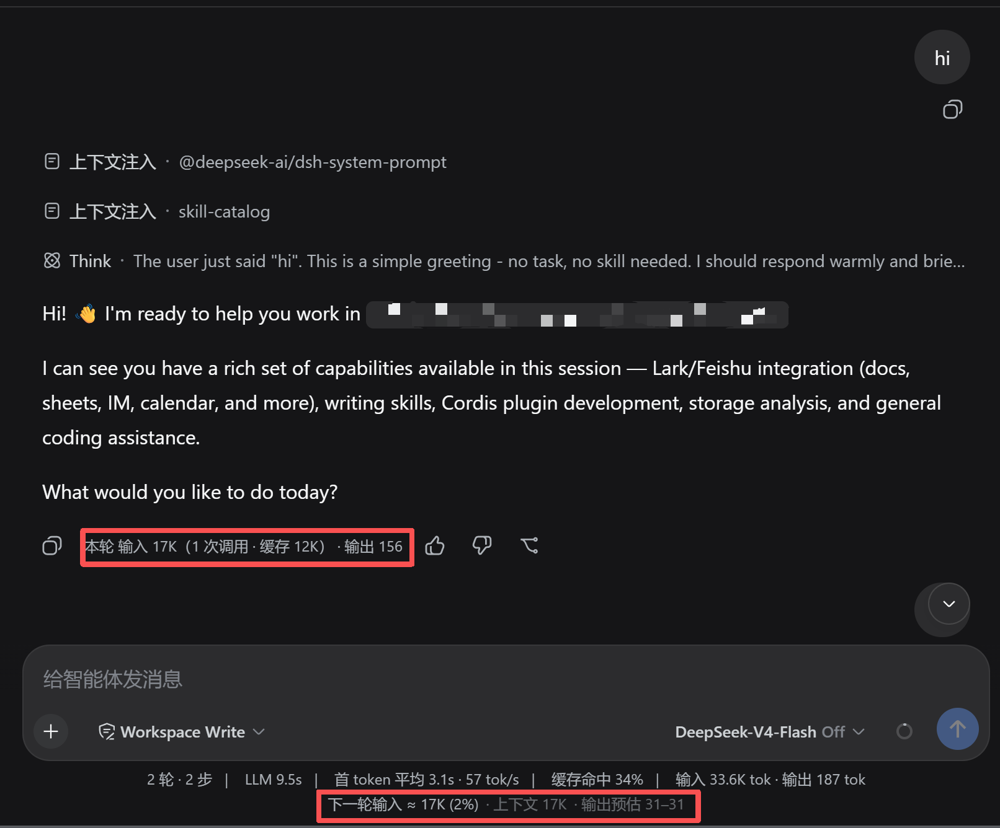
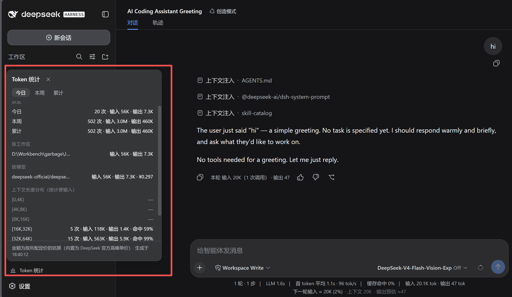

# dsh-plugins

简体中文 | [English](./README.en.md)

个人 [DeepSeek Harness (DSH)](https://github.com/deepseek-ai/deepseek-harness) 扩展集。
一个 repo = 一个 profile bundle：所有插件集中在一个包里，新增插件只需改代码 + 重启，无需重装。

## 插件清单

| 插件          | 功能                                                                                      |
| ----------- | --------------------------------------------------------------------------------------- |
| **tokprev** | Composer 底部"下一轮 token 输入预告"（上下文 + 排队 + 草稿，随打字实时跳动）+ 每轮收尾消息上的真实消耗徽标（提供商上报：输入/缓存/输出/调用次数） |
| **tokstats** | 侧栏脚按钮弹层面板：跨会话 token 消耗统计（时间段总览 / 按工作区 / 按模型含成本 / 上下文长度分布，今日·本周·累计三档切换） |

> 本包从 v0.2.4 起是**混合包**：tokprev 是纯浏览器 UI；tokstats 含 host 半边实现（扫 durable 会话日志聚合、checkpoint 增量、projection 下发）。

## 语言（中文 / English）

两个插件的界面文案都走宿主 locale 服务，**跟随 DSH 设置 → 常规 → Language**，插件自身没有语言开关。

- 词典按插件划分命名空间：`dsh-plugins.tokprev` 与 `dsh-plugins.tokstats`，由 `lib/client.js` 的 apply 注册（zh 为键集真源，en 必须逐键对应，测试双向断言）。
- 用户没显式选过时，宿主取浏览器语言；非 zh/en 回落 en。
- `locale` 是本包的**硬依赖**（与官方 UI 包一致）：宿主没有 locale 服务（或被手动禁用）时整包不加载——表现为插件 UI 消失且无日志，而不是半中半英。
- 数字记号（1.2K / 3.4M）、上下文桶区间（`[0,4K)`）与金额符号 ¥ 不翻译（英文语境同样通用，且 ¥ 是 DeepSeek 官方人民币价，写成 CNY 反而误导）；面板脚注时间固定 24 小时制，不跟浏览器 locale。

## tokprev 用途说明

单轮 token 消耗的"事前预告 + 事后实报"闭环：发送前告诉你这一轮大概要喂多少 token，轮次结束后用提供商上报的真数对账。



### 发送前预告（Composer 底部）

形态示例：

> **下一轮输入 ≈ 36.2K (28%)** · 上下文 33.8K + 排队 0.1K + 草稿 0.3K · 输出预估 1.5K–3K

- **下一轮输入** = 上下文基座（`contextPressure.projectedTokens`，提供商锚定）+ 排队消息 + 草稿，随打字实时跳动；
- **占比** = 下一轮输入 / 上下文窗口；
- **输出预估** = 最近 5 轮真实 `outputTokens` 的 [P25, P75] 区间；无历史时显示 `-`，仅 1 轮时显示 `≈该值`；
- 降级：空会话无锚点时回退启发式估算（`contextBreakdown` 三桶求和），上下文数字加 `*` 前缀；会话运行中整行隐藏（预测对象不存在），空闲恢复。

### 每轮收尾真实消耗徽标

每轮最后一跳 assistant 消息上渲染一行弱化小字（durable，刷新页面、翻历史轮都在）：

> `本轮 输入 12.4K（3 次调用 · 缓存 11.8K）· 输出 2.1K`

- 数据为该轮所有调用 `usage` 求和的提供商上报真数；计费输入 = `inputTokens + cacheReadTokens + cacheWriteTokens` 三桶之和；
- 悬浮可见精确 token 数与调用次数。

### 口径提醒（预告 ≠ 徽标）

- **预告** 是单次请求的 prompt 大小估算；
- **徽标** 是该轮**所有调用的计费输入总和**——多步轮每步重发全量上下文，累计远大于单次请求，缓存命中字段（徽标里的"缓存"段）可解释差额。两者口径不同但均有意义，不矛盾。

### 依赖的宿主契约

UI slot `conversation.composer.dock`、`conversation.chat.assistant-actions`；投影字段 `contextPressure` / `contextBreakdown`；`AssistantMessageNode.usage`。所有读取路径均带优雅降级（拿不到数据渲染 null，不会报错）。

## tokstats 用途说明

跨会话 token 消耗统计：宿主 StatsLine 只看单会话，本插件扫全部 durable 会话日志回答「今天烧了多少」「哪个项目吃得最多」「长上下文请求占比多高」。



侧栏底部「Token 统计」按钮（rail 模式为图标位）点开弹层面板：

- **总览**：今日 / 本周（周一起）/ 累计 三行——请求数 + 四桶（纯 token，不含金额）；
- **按工作区**：Top 8（子会话消耗沿 parent 链归并到根工作区，fork 的 seed 前缀去重不双计）；
- **按模型**：provider/model 分组，含按定价估算的成本列（未配价显示「未配价」）；
- **上下文长度分布**：计费输入按 2 的幂对数桶 `[0,4K)…[128K,∞)` 的请求数 / 输入 / 输出 / 缓存命中率。

口径与宿主一致：计费输入 = `inputTokens + cacheReadTokens + cacheWriteTokens`；同 `(turn,step)` 的最终 `assistant/message.usage` 替换 usage chunk 采样（不双计）。金额为**估算**：内置 DeepSeek 官方高峰单价（元/Mtok，可在 patch 行覆盖），面板有标注。

### 定价配置（可选）

内置价只覆盖 `deepseek-official` 路由。第三方 provider 在你的 profile patch（`~/.dsh/profiles/web/cordis.patch.yml`）追加覆盖/自定义价（元/Mtok）：

```yaml
- id: tokstats
  patch:
    config:
      prices:
        ark-codingplan:
          glm-5.3: { input: 2, inputCached: 0.2, output: 4 }
```

（profile patch 按 id 定向覆盖行 config，与 dsh 官方 patch 语义一致。）

### host 侧行为

- 启动异步扫盘（不阻塞 boot）：`listSnapshots` 对账 checkpoint（`$DSH_HOME/storages/tokstats-checkpoint.json`，键 `(sessionId, storage revision)`），只重扫日志变更过的会话；checkpoint 损坏自动全量重扫；
- 活会话 flush 后从上次 seq 增量续折，变更防抖落盘；
- 数据经 `sessionProjections` 通道（`tokstats` unit）下发；首次安装后需任一会话被打开或推送到达才有值（面板在此之前显示「统计中…」）；
- 全链路降级：persistence/projection 缺席不抛错，面板显示对应提示。

## 安装（web profile）

前置：Node.js、git、pnpm（`npm i -g pnpm`）。私有仓库也可安装（pnpm 走你本机 git 凭据）。

```powershell
# 从 GitHub 安装（其他用户）
npx @deepseek-ai/dsh plugin --profile web add github:PlusQi/dsh-plugins

# 固定版本：# 后可跟 tag / 分支 / commit
npx @deepseek-ai/dsh plugin --profile web add github:PlusQi/dsh-plugins#v0.2.3

# 本机开发链接（改代码重启即生效，路径换成你本地的仓库位置）
npx @deepseek-ai/dsh plugin --profile web add link:D:\path\to\dsh-plugins
```

安装后**重启 dsh web 进程**并刷新页面（profile 组合仅启动时生效）。
安装位置：`$DSH_HOME/profiles/web/`（默认 `~/.dsh`）。`dsh plugin` 是 pnpm 转发器：
装完后自动把声明了 `dsh.bundle` 的包挂进 `dsh.profile.bundles` 层列表，无需手改配置。
本包无构建脚本，git 安装不会触发 pnpm 的 build-script 拦截（allowBuilds）。
若发到 npm，`npx @deepseek-ai/dsh plugin --profile web add dsh-plugins` 同理。

## 更新 / 卸载 / 单插件开关

```powershell
# 更新：重新解析安装 spec（未固定 ref 则拉默认分支最新提交）
npx @deepseek-ai/dsh plugin --profile web update dsh-plugins

# 整包卸载（自动从层列表摘除）
npx @deepseek-ai/dsh plugin --profile web remove dsh-plugins
```

临时关掉单个插件（不动代码）：编辑 `~/.dsh/profiles/web/cordis.patch.yml` 追加

```yaml
- id: tokprev
  disabled: true
```

重启生效。注意行的真实语义：`disabled` 只摘除该行的 **host 侧** fiber，浏览器侧 bundle 是否加载取决于**包内是否还有任一行存活**（DSH 的 boot graph 按包名判活，客户端每包一个 fiber、无条件注册全部插件）。对 tokstats 这类 host 半边有实际工作的插件，禁用行即停掉聚合器与统计（客户端按钮还在但无数据）；对 tokprev 这类纯 UI 插件，禁用一行**不会**移除其浏览器 UI（tokstats 行会让整个 bundle 存活）。需要按插件独立开关，请把该插件独立成包（见下文「新增插件」末尾）。

## 发布到 GitHub（维护者）

```powershell
git remote add origin git@github.com:PlusQi/dsh-plugins.git
git push -u origin master
git tag v0.2.0; git push --tags   # 可选：给用户可固定的版本打 tag
```

**打 tag 前的硬门槛**（v0.2.0 三连败的教训，详见 [postmortem](./docs/debug/postmortem-v0.2.md)）：link 安装目标提交 -> 重启 dsh web -> 刷新页面，目检**每个插件**的 UI 元素实际渲染。"启动无报错 ≠ 插件正常工作"——slot 注册是副作用，apply 提前返回或抛错都可能静默失效。目检不过不打 tag。

推上去即可被安装，无需注册表。`files` 字段保证 git 安装只带
`lib/` + `cordis.patch.yml`（pnpm 打包时自动附带 README / LICENSE / package.json）。

## 新增插件（本包的维护模式）

1. `lib/client.js` 的 `PLUGINS` 注册表加一段：`css` + **`ns`** + **`dicts`** + `apply(ctx)`（helpers、组件、词典、`ctx.slots.inject(...)` 注册块都放这段里）：

   ```js
   const LOCALE_NS_XXX = "dsh-plugins.xxx";
   const xxxZh = { "row.title": "标题" };
   const xxxEn = { "row.title": "Title" };
   // PLUGINS 内：xxx: { css: xxxCss, apply: xxxApply, ns: LOCALE_NS_XXX, dicts: { zh: xxxZh, en: xxxEn } }
   ```

   `npm run guard` 会拦下漏带 `ns` / `dicts` 的注册块；该插件确无任何界面文案时显式写 `ns: null`。

2. `cordis.patch.yml` 加一行（`name` 固定 `'dsh-plugins'`，`config.plugin` 指向注册表键；id 带自己的前缀，别撞 dsh-base/dsh-web-app 内置 id）：

   ```yaml
   - id: xxx
     name: 'dsh-plugins'
     config:
       plugin: xxx
   ```

3. **文案一律走词典**：slot 注册声明 `locale: ns` 取得标准席位 `t`，文案写成 `{name}` 占位符整句模板（英文按英文语序重写，不做片段拼接），带计数的文案按 `.one` / `.other` 成对出键；测试里调 `assertDictPair`（`test/client-harness.mjs`）断言 zh/en 键集一致——本包无构建步骤，官方那层编译期保障只能由它替代。术语对照见 [AGENTS.md](./AGENTS.md) 硬规则 7。

4. 在本地留存该插件的决策记录（不随仓库分发，供维护者回溯）；
5. 重启进程。**零安装操作。**

多插件结构的四条硬约束（来自 DSH 本体，调整前先读）：

- **client bundle 按包名发现**：host 按 entry 的 `name` 解析 `<name>/package.json` 读 `dsh.client` 声明，整包服务 `exports["./client"]`。行 name 必须是裸包名 `dsh-plugins`；写成 `dsh-plugins/xxx` 子路径只剩 host 半边（dsh-web-app 的 `web-startup` 行就是这种 host-only 子路径用法）。
- **client 模块图按包扁平**：一个包的 client 半边 = 一个模块节点，包内不能拆多文件（bundle factory 里的 `require` 只认模块表词，相对路径直接抛错）。所有插件共用 `lib/client.js` 单文件靠分段纪律维护，这是"无构建步骤"的边界。
- **host 按行分 fiber，client 每包单 fiber**：patch 每行建一个 **host** fiber，`config.plugin` 是 host 侧分发键（dsh-base 的 `tool-subagent` / `tool-subagent-fork` 是同名多行参考）。本包 `lib/index.js` 的 `apply(ctx, config)` 按该键分发：纯 UI 插件的 host 半边为空（行即存在/禁用锚点），tokstats 的 host 聚合器宿主在 `tokstats` 行的 fiber 上（行禁用 = 统计停摆）。**client 侧 `__DSH_BOOT__` 每包只建一个条目且不传 config**（`dsh-client-modules` 按包名构建 boot graph），因此 `lib/client.js` 的 apply 无条件注册 `PLUGINS` 全部插件，靠组件数据不可用时返回 null 降级；客户端不存在"第二行再跑一遍 apply"，也不可能在客户端按 `config.plugin` 分发。host 半边额外受模块图约束：pnpm link 安装下插件真实路径不在宿主 node_modules 树内，**npm 包 import 不可解析**——`lib/index.js` 只用 `node:` 内建 + `apply(ctx, config)` 参数，不 import cordis/zod 等运行时依赖。
- **样式按插件分 tag**：每插件一个 `data-plugin-css="dsh-plugins/<id>"` tag（`ensurePluginStyles` 幂等注入、随包 fiber 停止移除）；保持插件块独立颗粒度，日后单插件独立成包时连样式原样带走。

插件长大了要独立发布/独立 repo？把注册块连同 patch 行复制出去单开包即可（可参考本仓库已有插件的实现与打包方式）。

## 维护须知

> 维护者与 AI Agent 的执行入口见 [AGENTS.md](./AGENTS.md)（路由表 + 硬规则 + 结构 guard）；本节为人类可读的详述。

- **无构建步骤**：`lib/client.js` 即最终产物（纯 JS，不用 TS/JSX，React 经 ModuleLoader 注入）。改动 = 编辑 + 重启。`lib/index.js`（host 半边）同为纯 JS：只 import `node:` 内建（fs/os/path），不引 npm 运行时依赖。
- **兼容面**：tokprev 依赖 UI slot 契约（`conversation.composer.dock`、`conversation.chat.assistant-actions`）与投影字段（`contextPressure`/`contextBreakdown`/`AssistantMessageNode.usage`）；tokstats 依赖 slot `sidebar.footer.action`（root scope，标准位仅 `useSessions`/`useWorkspaces`，projection 值从会话列表快照的 `projectionValues` 读）、host 侧服务 `ctx.sessionPersistence`（`listSnapshots`/`inspect`/`readStoredRevision`）与 `ctx.sessionProjections`（注册 `tokstats` unit）、事件 `session/flush`；界面文案另依赖客户端服务 `ctx.locale`（注册词典 + slot 注册声明 `locale` 命名空间取得 `t` 席位）——它是硬依赖，缺席时整包不加载。DSH 升级后若插件消失，先对照这些契约。所有读取路径均带优雅降级（拿不到数据渲染 null，不会报错）。
- **开发所对版本**：DSH `@deepseek-ai/dsh 0.1.1-rc.2`。
- **开发循环**：先用动态 Cordis 插件（`cordis_define` -> `cordis_run`）在会话内热迭代原型，满意后落入本包。

## License

[MIT](./LICENSE)
